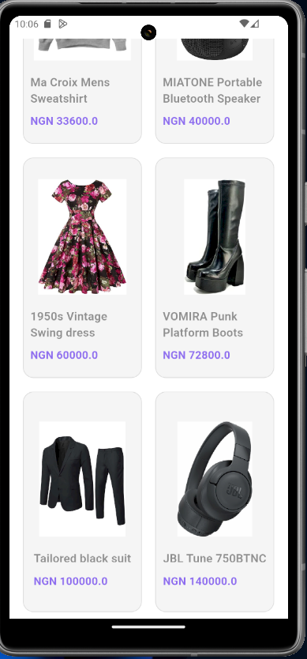

# Timbu API Implementation

[Timbu](https://timbu.cloud) is a business management, finance and marketing tool that helps your business be more organized and grow. This app retrieves and displays products from the [Timbu API documentation](https://docs.timbu.cloud/api/intro). It showcases product information, including images and prices, in a user-friendly grid layout.

## Setup Instructions

### Prerequisites

- Install [Flutter SDK](https://flutter.dev/docs/get-started/install)
- Install [Android Studio](https://developer.android.com/studio) or [Xcode](https://developer.apple.com/xcode/) for iOS development.
- Create an account on [Timbu](https://timbu.cloud). Get your API key. Add some products information on your timbu account under Retail Business. Go through the [Timbu API documentation](https://docs.timbu.cloud/api/intro) to understand the implementation.

1. **Clone the Repository**

   ```sh
   git clone https://github.com/ogunkapc/Timbu
   cd timbu
   ```

2. **Add your Timbu API key**

    - Create a keys.dart file in the lib directory with the following content:

    ```dart
    class ApiKeys {
        static const String apiKey = 'your_api_key';
        static const String appId = 'your_app_id';
        static const String orgId = 'your_org_id';
    }
    ```

    - Ensure `keys.dart` is added to .gitignore to avoid exposing your keys.

3. **Install dependencies**

    ```sh
    flutter pub get
    ```

4. **Run the app**

    ```sh
    flutter run
    ```

## App Screenshots

  

## Links

[Here](https://drive.google.com/drive/folders/1gdeLCv6a5PWnWxW8iW9Cw9nMhbepZKfy?usp=sharing) you can find a virtualized demonstration of the release version of the app.

[APK Download link](https://appetize.io/app/b_6wrby4zwlkklyxu3q6bksz25ca)
